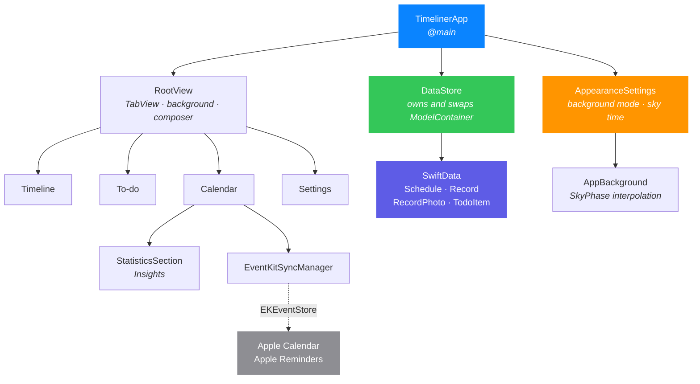
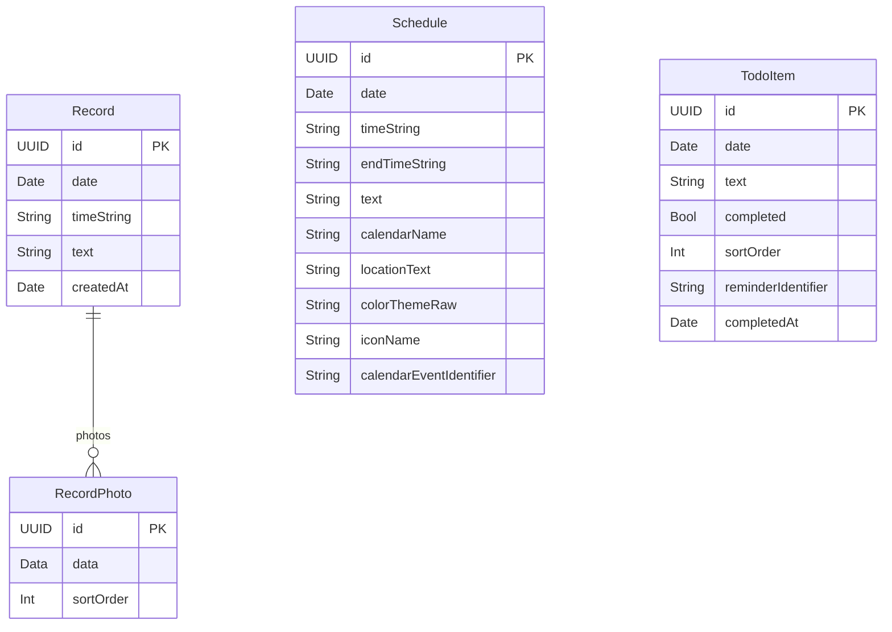

<div align="center">


# Timeliner

**An iOS app that threads what you wrote down, what you have to do, and what you have scheduled — onto a single time axis.**

No hopping between a notes app, a to-do app, and a calendar. The day reads as one line.

<br />


[한국어](README.md) · **English**

</div>

> **Note** — the app's interface is Korean-only. The screenshots below show Korean text; this document is a translation of [README.md](README.md).

---

## Contents

- [What Timeliner is](#what-timeliner-is)
- [Screens](#screens)
- [A background that moves with the hour](#a-background-that-moves-with-the-hour)
- [Features](#features)
- [Architecture](#architecture)
- [Data model](#data-model)
- [Implementation notes worth a look](#implementation-notes-worth-a-look)
- [Getting started](#getting-started)
- [Project layout](#project-layout)
- [Things to know before contributing](#things-to-know-before-contributing)
- [Known limitations](#known-limitations)
- [Credits](#credits)
- [Licence](#licence)

---

## What Timeliner is

Most apps file things by **kind**: notes with notes, tasks with tasks, events with events.
But when you look back on a day, the order you actually reach for is not kind — it is **time**.

Timeliner threads all three onto one vertical rail, in the order they happened.
A note from the morning, then the 10 o'clock meeting, then a photo from around lunch,
then a blue dot marking **now**, and below it the part of the day that hasn't arrived yet.

| | |
|---|---|
| 🕰️ **One time axis** | Records, to-dos and schedules share the same rail |
| ⌨️ **Input where your thumb already is** | A pill in the tab bar; tapping it grows a composer out of that spot |
| 🌤️ **A background that flows with the hour** | Sky and screen brightness shift together through dawn, noon, sunset, night |
| 🔄 **Apple Calendar & Reminders** | Pulls in what you already keep there |
| 📊 **What shows up once days accumulate** | Activity by weekday, the hours you tend to write in, an activity heatmap |
| 🔒 **On-device only** | SwiftData, stored locally. No account, no server, no collection |

---

## Screens

<table>
<tr>
<td width="33%" align="center">
<br />
<b>Timeline</b><br />
<sub>Everything on one axis.<br />The blue dot is <b>now</b>.</sub>
</td>
<td width="33%" align="center">
<br />
<b>To-do</b><br />
<sub>Grouped by date.<br />Completed items can be folded away.</sub>
</td>
<td width="33%" align="center">
<br />
<b>Calendar</b><br />
<sub>Month grid, that day's agenda,<br />and the Apple Calendar import.</sub>
</td>
</tr>
<tr>
<td width="33%" align="center">
<br />
<b>Insights</b><br />
<sub>Sits under the calendar's agenda,<br />where the question naturally comes up.</sub>
</td>
<td width="33%" align="center">
<br />
<b>Settings</b><br />
<sub>Background mode, sky-time preview,<br />sample/real data switch.</sub>
</td>
<td width="33%" align="center">
<sub><br /><br /><br />
Captured on an iPhone 17 Pro / iOS 27 simulator<br />
in <code>sample data</code> mode.
<br /><br /><br /></sub>
</td>
</tr>
</table>

---

## A background that moves with the hour

In `Sky` mode the background flows with the clock. Eight phases — midnight, dawn, morning,
noon, afternoon, evening, sunset, night — each carry a palette, and what you actually see is
**somewhere between the two nearest ones**. A minute's change of time is a minute's change of sky.

<table>
<tr>
<td align="center"><br /><b>05:30 · Dawn</b></td>
<td align="center"><br /><b>12:30 · Noon</b></td>
<td align="center"><br /><b>20:00 · Sunset</b></td>
<td align="center"><br /><b>22:30 · Night</b></td>
</tr>
</table>

> **Why the crossfade never turns to mud**
> Mixing sRGB numbers directly is what makes a blue-to-orange crossfade pass through mud:
> those numbers are gamma-encoded, and averaging them is not averaging any light.
> Timeliner converts each colour back to **linear light**, mixes there, and encodes back to sRGB
> (`SkyRGB` in [`Theme.swift`](TimelinerApp/Timeliner/Theme/Theme.swift)).
> Light/dark chrome is decided in the same place, from the sky's own relative luminance —
> so a combination like "bright sky, dark text" is not expressible at all.

There are five background modes:

| Mode | What it does |
|---|---|
| `Sky` | Sky and brightness follow the hour |
| `Light` / `Dark` | Pinned to a bright / dark background |
| `System` | Follows the device's light/dark setting |
| `Custom` | Your own photo, or one of ten Unsplash photographs |

The **sky time** slider in Settings previews the sky at any hour of the day.
It moves the background only — the timeline's `now` stays anchored to the real clock,
so nothing about what is past and what is upcoming is ever a lie.

---

## Features

<details open>
<summary><b>Timeline</b> — the day as one line</summary>

- **One rail** — records, to-dos and schedules thread onto the same vertical line in time order, with each row's time set in a single column above its card.
- **The now marker** — a blue dot and a hairline mark the current moment, and the app opens positioned there.
- **Loading more past** — two weeks by default; each pull at the top loads a fortnight more, keeping the row you were reading in place.
- **Revealing the future** — pulling up from the bottom lifts upcoming items in, one card a beat after the last.
- **Finished to-dos move** — a completed item relocates from when it was written down to when the work actually ended (`completedAt`).
- **Photos** — several per record, tappable from the grid into a full-screen viewer.

</details>

<details open>
<summary><b>Capturing</b> — a composer that grows out of the tab bar</summary>

- The input pill lives in the tab bar (`tabViewBottomAccessory`), always in reach.
- Tapping it grows the composer **out of the pill's own frame** into a full screen. The default slide-up sheet animation is deliberately suppressed.
- Inside the composer you choose **record / to-do / schedule**, and attach a date, a time, and photos.
- Scrolling down minimises the tab bar (`tabBarMinimizeBehavior(.onScrollDown)`).

</details>

<details open>
<summary><b>Apple Calendar & Reminders</b></summary>

- **Todos ↔ Reminders go both ways.** What you make in Reminders is imported; what you write in Timeliner is created over there. Text, date, completion and deletion all flow in both directions.
- **You pick the Reminders list.** Settings chooses where new todos land; the edit sheet overrides it for one todo.
- Events are still one-way — "save to Apple Calendar" in the edit sheet exports them, and importing always works.
- **Only what is actually gone gets deleted.** An item that moved outside the import window, or lost its due date, is checked for existence first and then followed to its new date rather than removed.
- Calendar and Reminders permissions are requested **separately**; granting one still syncs that one.
- Reminders with no date have nowhere to sit on a time axis, so they are not imported — and the count of skipped ones is reported.

</details>

<details open>
<summary><b>Insights</b> — under the calendar tab</summary>

For this week or this month:

- Records written, schedules ahead
- To-do completion rate
- Activity by weekday (Swift Charts)
- The hours you tend to write in (morning · afternoon · evening/night)
- Activity heatmap

> These used to be a tab of their own. As a section under the calendar's agenda they answer
> the question the calendar raises — you have just looked at a month, and this is what the month
> came to — instead of asking you to go and find them.

</details>

<details>
<summary><b>Sample / real data modes</b> — a development affordance</summary>

Switchable from Settings. Rather than a flag on every model, **the store file itself is split.**

- Nothing that reads data has to know the mode exists: no `@Query` gains a predicate.
- No sample row can leak into real data by way of a filter someone forgot to add.
- The cost is that the two sets cannot see each other, which is exactly what is wanted here.
- Seed data is `#if DEBUG` and only ever goes into the sample store.

</details>

---

## Architecture



The stack is thin. **There are no external dependencies** — no package manager, no third-party libraries.

| Layer | What it uses |
|---|---|
| UI | SwiftUI (iOS 26 Liquid Glass, `TabView` + `tabViewBottomAccessory`) |
| State | `@Observable`, `@StateObject`, `@AppStorage`, `@Query` |
| Storage | SwiftData (`ModelContainer`, CloudKit disabled) |
| Charts | Swift Charts |
| Integration | EventKit |
| Images | PhotosUI, ImageIO (`CGImageSource` thumbnails) |
| Tests | Swift Testing (`@Suite` / `@Test`) |

---

## Data model



What the diagram leaves out:

| | |
|---|---|
| `RecordPhoto.data` | `.externalStorage` — image bytes live outside the store row |
| `Record.photos` | Delete rule `.cascade`; ordering is done explicitly via `sortOrder`, since relationships come back unordered |
| `Schedule.calendarEventIdentifier` · `TodoItem.reminderIdentifier` | The key back to the EventKit original — how a vanished source is found and cleaned up |
| `TodoItem.completedAt` | When it was ticked off; cleared again if un-ticked, and read by the timeline to relocate the row |
| Nullable | `Schedule`'s time, end time, calendar name and location; `TodoItem.completedAt` |

> **Why photos are their own entity**
> A `[Data]` on `Record` would be stored by SwiftData as a **single encoded value**, which puts
> `.externalStorage` out of reach and drags every attached photo along on any fetch of the record.
> The timeline fetches a great many records, so the blobs have to stay outside the row.

---

## Implementation notes worth a look

<details>
<summary><b>1. The rail and its markers come from one expression</b> — <code>TimelineRailMetrics</code></summary>

The rail line and the markers threaded onto it used to land **3 to 7 points apart**.
The line was positioned from the column widths, each marker from its own row's `HStack` spacing —
and that spacing differed per row kind (6 for schedules, 2 for records and to-dos).

Both are now derived from one struct. The invariant is `lineCenterX == markerCenterX`, and it holds
for any widths. In exchange, rows must **not put `HStack` spacing in front of the rail column** —
spacing inserted there shifts the marker without the line knowing.

The project's only unit-test suite guards exactly this — 7 tests, most of them parameterised over
5 different layouts.

[`TimelineRailMetrics.swift`](TimelinerApp/Timeliner/Views/Timeline/TimelineRailMetrics.swift) ·
[`TimelineRailMetricsTests.swift`](TimelinerApp/TimelinerTests/TimelineRailMetricsTests.swift)

</details>

<details>
<summary><b>2. Swapping the store without collapsing the screen</b> — <code>DataStore</code></summary>

Switching between sample and real data replaces the whole `ModelContainer`. The naive fix is
`.id(dataStore.mode)` to re-key the view tree — but that **throws away the screen the switch was
made on**: the settings tab would vanish under the finger that tapped it.

Instead `DataStore` keeps every container this session has opened alive. Not a cache for speed:
rows from the outgoing store are still on screen for the frames it takes SwiftUI to notice, and a
SwiftData model object outlives its container only as far as the next property read — after that it
traps. Holding the old container keeps those objects legible until nothing is looking at them.

[`DataStore.swift`](TimelinerApp/Timeliner/Utils/DataStore.swift)

</details>

<details>
<summary><b>3. Judging the release</b> — pull to load more past</summary>

Pulling far enough at the top and letting go loads another fortnight. The release cannot be judged
by the pull progress at that moment: letting go starts the rubber band snapping back, and the
geometry has already reported its way to zero by the time the scroll-phase change arrives.

So the threshold is **latched when it is crossed** (`topPullArmed`), and pushing back up before
release clears it again.

[`TimelineView.swift`](TimelinerApp/Timeliner/Views/Timeline/TimelineView.swift)

</details>

<details>
<summary><b>4. Photos are downsampled to 1,200px before they are drawn</b></summary>

Turning the original `Data` into a `UIImage` blows memory up while the timeline scrolls.
Instead `CGImageSourceCreateThumbnailAtIndex` produces a 1,200px thumbnail into a cache, decoded
off the main thread (`nonisolated`), with the EXIF transform applied at the same time.

Background images are separate: `URLCache` is sized up to 32 MB in memory / 256 MB on disk, because
a chosen background should survive a relaunch and a flight.

</details>

<details>
<summary><b>5. The sky flows rather than snaps</b></summary>

Phases used to be **ranges**, and the sky snapped from one to the next at their borders.
They are **anchors** now: each phase has the hour it is most itself at (sunset = 20:00, say), and
the sky is whatever lies between the two nearest ones.

Palettes have different numbers of stops (three to five), so they are resampled to a common count
before any two are mixed.

</details>

---

## Getting started

### Requirements

| | |
|---|---|
| Xcode | A version with the iOS 26 SDK |
| Deployment target | iOS 26.0 (one feature needs 26.1) |
| Devices | iPhone · iPad (simulator is fine) |
| Dependencies | **None** — clone and build |

### Build and run

```bash
git clone https://github.com/Nedian0Brien/Timeliner.git
```

```bash
open Timeliner/TimelinerApp/Timeliner.xcodeproj
```

Pick the `Timeliner` scheme and hit ⌘R.

From the command line, against a simulator:

```bash
xcodebuild -project TimelinerApp/Timeliner.xcodeproj -scheme Timeliner -configuration Debug -destination 'platform=iOS Simulator,name=iPhone 17 Pro' -derivedDataPath build build
```

### Tests

```bash
xcodebuild test -project TimelinerApp/Timeliner.xcodeproj -scheme Timeliner -destination 'platform=iOS Simulator,name=iPhone 17 Pro'
```

> The shared scheme (`xcshareddata/xcschemes/Timeliner.xcscheme`) is what lets `xcodebuild test`
> find the test target. `.gitignore` is written so that path survives.

### First launch

Debug builds start in **sample data** mode and populate design fixtures automatically.
To see the empty state, switch to **real data** in Settings — that store has never been seeded.

---

## Project layout

```
TimelinerApp/
├── Timeliner.xcodeproj/
│   └── xcshareddata/xcschemes/Timeliner.xcscheme   # shared scheme (needed by tests)
├── Timeliner/
│   ├── TimelinerApp.swift          # @main · URLCache · storage warning banner
│   ├── ContentView.swift           # RootView · tabs · bottom input pill
│   ├── Models/
│   │   ├── Record.swift            # record + RecordPhoto
│   │   ├── Schedule.swift          # schedule (+ colour theme)
│   │   └── TodoItem.swift          # to-do (+ completedAt)
│   ├── Views/
│   │   ├── Timeline/               # the rail, cards, composer, photo viewer
│   │   │   ├── TimelineView.swift          # largest file: scrolling, grouping, pulls
│   │   │   ├── TimelineRailMetrics.swift   # single source of rail geometry
│   │   │   ├── RecordInputView.swift       # tab-bar input pill
│   │   │   ├── RecordComposerView.swift    # composer that grows out of the pill
│   │   │   ├── ScheduleRowView.swift · TodoRowView.swift · TimelineGroupView.swift
│   │   │   └── PhotoViewerView.swift
│   │   ├── Todo/TodoListView.swift
│   │   ├── Calendar/CalendarView.swift     # month grid · agenda · sync card
│   │   ├── Statistics/StatisticsView.swift # StatisticsSection (embedded in Calendar)
│   │   ├── Search/SearchView.swift         # ⚠️ currently not reachable from anywhere
│   │   ├── Modals/                         # schedule detail · record edit
│   │   └── Settings/SettingsView.swift
│   ├── Theme/
│   │   ├── Theme.swift             # SkyPhase · SkyRGB · AppBackground · glass cards
│   │   └── ThemeManager.swift      # AppearanceSettings (background mode · sky time)
│   ├── Services/
│   │   └── EventKitSyncManager.swift
│   ├── Utils/
│   │   ├── DataStore.swift         # owns and swaps the sample/real containers
│   │   ├── DateHelpers.swift       # Korean date labels · 12/24-hour conversion
│   │   └── SeedData.swift          # #if DEBUG fixtures
│   └── Assets.xcassets/
└── TimelinerTests/
    └── TimelineRailMetricsTests.swift

docs/screenshots/            # images used by this README
scripts/
└── serve-sim-cloudflare-proxy.mjs   # dev proxy folding the simulator stream onto one port
.gitattributes               # line-ending normalisation · no auto-merge for pbxproj
```

---

## Things to know before contributing

This repository has a few traps.

> [!IMPORTANT]
> **The Xcode project does not use file-system synchronized groups.**
> Adding or removing a file means editing `project.pbxproj` by hand. Back it up first.
> For the same reason `.gitattributes` turns off auto-merge for that file — a merge conflict
> there is yours to resolve.

> [!WARNING]
> **Do not delete the shared scheme.**
> `TimelinerApp/Timeliner.xcodeproj/xcshareddata/xcschemes/Timeliner.xcscheme` is what lets
> `xcodebuild test` find the test target.

> [!NOTE]
> **The deployment target is iOS 26.0, so `if #available` branches are usually unnecessary.**
> The only one left in the codebase is for iOS 26.1's `tabViewBottomAccessory`.

> [!NOTE]
> **Never seed the real store.** `SeedData` is `#if DEBUG` and belongs to the sample store alone.

The repository also keeps working rules for coding agents in [`AGENTS.md`](AGENTS.md) /
[`CLAUDE.md`](CLAUDE.md) — things like *don't claim you fixed something you haven't seen on screen*
and *measure instead of guessing from a screenshot*. They read fine for humans too.

---

## Known limitations

| | |
|---|---|
| 🔌 **Search is not reachable** | `SearchView` is implemented but nothing presents it. The timeline hid its navigation bar, which took the `.searchable` field with it, and no new entry point has replaced it. |
| ☁️ **No sync** | `cloudKitDatabase: .none`. Data lives on the device. |
| ↔️ **Apple Calendar is still one-way** | Todos ↔ Reminders sync both ways; events only leave Timeliner through the edit sheet. |
| 🌐 **Korean-only UI** | Strings are inline in the source; nothing is localised yet. |
| 📱 **iPad is a scaled-up phone** | The build is universal, but there is no large-screen layout yet. |

---

## Credits

- Custom-background photographs are by Unsplash photographers, served through
  [Lorem Picsum](https://picsum.photos) — Unsplash's own API needs a key and their site refuses
  scrapers. The app shows each photographer's name and a link to the original page.
  NASA, Greg Rakozy, Joshua Hibbert, Alexey Topolyanskiy, Andrew Ridley, Wolfgang Lutz,
  Christian Joudrey, Steve Carter, Ales Krivec, Philippe Wuyts.
- Icons are Apple SF Symbols.

---

## Licence

[MIT](LICENSE). Use it, change it, ship it — just keep the copyright notice.

<div align="center">
<br />
<sub>Made with SwiftUI · an app that lives on your device</sub>
</div>
