<div align="center">

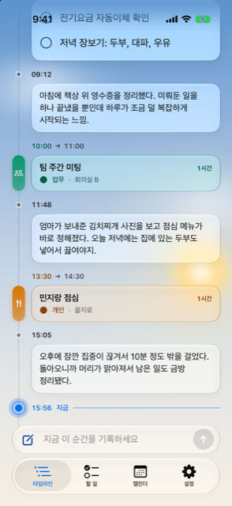

# Timeliner

**하루에 남긴 기록과, 해야 할 일과, 잡아둔 일정을 — 하나의 시간 축 위에 엮는 iOS 앱**

메모 앱과 할 일 앱과 캘린더 앱을 오가지 않아도, 오늘 하루가 한 줄로 읽힙니다.

<br />


**한국어** · [English](README.en.md)

</div>

---

## 목차

- [Timeliner는 무엇인가](#timeliner는-무엇인가)
- [화면](#화면)
- [시간을 따라 흐르는 배경](#시간을-따라-흐르는-배경)
- [기능](#기능)
- [아키텍처](#아키텍처)
- [데이터 모델](#데이터-모델)
- [눈여겨볼 구현](#눈여겨볼-구현)
- [시작하기](#시작하기)
- [프로젝트 구조](#프로젝트-구조)
- [기여할 때 알아둘 것](#기여할-때-알아둘-것)
- [알려진 한계](#알려진-한계)
- [크레딧](#크레딧)

---

## Timeliner는 무엇인가

대부분의 앱은 **종류**로 나눕니다. 메모는 메모끼리, 할 일은 할 일끼리, 일정은 일정끼리.
그런데 하루를 되돌아볼 때 우리가 실제로 떠올리는 순서는 종류가 아니라 **시간**입니다.

Timeliner는 그 셋을 한 줄의 세로 레일 위에 시간 순으로 꽂아 둡니다.
아침에 남긴 메모 아래에 10시 회의가 있고, 그 아래에 점심 무렵 찍은 사진이 있고,
그 아래에 파란 점으로 **지금**이 표시되고, 그 밑으로 아직 오지 않은 하루가 이어집니다.

| | |
|---|---|
| 🕰️ **하나의 시간 축** | 기록 · 할 일 · 일정이 같은 레일을 공유합니다 |
| ⌨️ **손이 닿는 곳에 입력창** | 탭 바에 붙은 입력 pill을 누르면 그 자리에서 컴포저가 자라납니다 |
| 🌤️ **시간을 따라 흐르는 배경** | 새벽·아침·정오·노을·밤에 따라 하늘과 화면 밝기가 함께 바뀝니다 |
| 🔄 **Apple 캘린더 · 미리알림 연동** | 기존에 쓰던 일정과 미리알림을 그대로 끌어옵니다 |
| 📊 **하루가 쌓이면 보이는 것** | 요일별 활동량, 주로 기록하는 시간대, 활동 히트맵 |
| 🔒 **기기 안에서만** | SwiftData 로컬 저장. 계정도, 서버도, 수집도 없습니다 |

---

## 화면

<table>
<tr>
<td width="33%" align="center">
<br />
<b>타임라인</b><br />
<sub>기록·할 일·일정이 한 축 위에.<br />파란 점이 <b>지금</b>입니다.</sub>
</td>
<td width="33%" align="center">
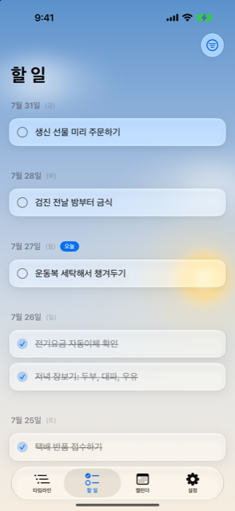<br />
<b>할 일</b><br />
<sub>날짜별로 묶인 목록.<br />완료 항목은 접어둘 수 있습니다.</sub>
</td>
<td width="33%" align="center">
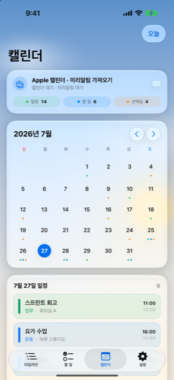<br />
<b>캘린더</b><br />
<sub>월 그리드 · 그날의 아젠다 ·<br />Apple 캘린더 가져오기.</sub>
</td>
</tr>
<tr>
<td width="33%" align="center">
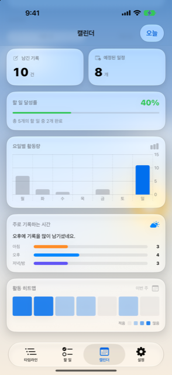<br />
<b>인사이트</b><br />
<sub>달을 한 번 본 뒤 이어서 읽도록,<br />캘린더 탭 아래에 붙어 있습니다.</sub>
</td>
<td width="33%" align="center">
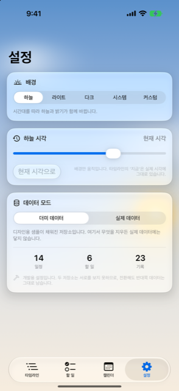<br />
<b>설정</b><br />
<sub>배경 모드 · 하늘 시각 미리보기 ·<br />더미/실제 데이터 전환.</sub>
</td>
<td width="33%" align="center">
<sub><br /><br /><br />
스크린샷은 iPhone 17 Pro / iOS 27 시뮬레이터에서<br />
<code>더미 데이터</code> 모드로 촬영했습니다.
<br /><br /><br /></sub>
</td>
</tr>
</table>

---

## 시간을 따라 흐르는 배경

`하늘` 모드에서는 배경이 시각을 따라 흐릅니다. 여덟 개의 시간대(자정·새벽·아침·정오·오후·저녁·노을·밤)가
각자의 팔레트를 가지고 있고, 실제 화면은 **가장 가까운 두 시간대 사이의 어딘가**입니다.
1분이 지나면 하늘도 1분만큼 변합니다.

<table>
<tr>
<td align="center">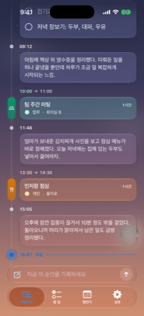<br /><b>05:30 · 새벽</b></td>
<td align="center">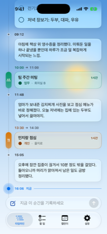<br /><b>12:30 · 정오</b></td>
<td align="center">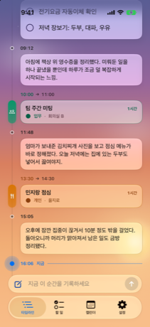<br /><b>20:00 · 노을</b></td>
<td align="center">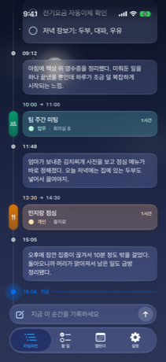<br /><b>22:30 · 밤</b></td>
</tr>
</table>

> **왜 색이 탁해지지 않는가**
> 팔레트를 sRGB 숫자 그대로 섞으면 파랑에서 주황으로 가는 길이 진흙탕을 지납니다.
> 그 숫자들은 감마로 인코딩되어 있어서, 평균을 내도 빛의 평균이 아니기 때문입니다.
> Timeliner는 색을 **선형 광원 공간**으로 되돌린 뒤 섞고, 다시 sRGB로 내보냅니다
> ([`Theme.swift`](TimelinerApp/Timeliner/Theme/Theme.swift)의 `SkyRGB`).
> 화면 밝기(라이트/다크)도 같은 곳에서 하늘의 상대 휘도를 읽어 결정하므로,
> "밝은 하늘 + 어두운 글자" 같은 어긋난 조합이 아예 표현될 수 없습니다.

배경 모드는 다섯 가지입니다.

| 모드 | 하는 일 |
|---|---|
| `하늘` | 시간대를 따라 하늘과 밝기가 함께 바뀝니다 |
| `라이트` / `다크` | 밝은 / 어두운 배경에 고정합니다 |
| `시스템` | 기기의 라이트·다크 설정을 따릅니다 |
| `커스텀` | 내 사진 또는 Unsplash 사진 10종 중 하나를 배경으로 씁니다 |

설정 탭의 **하늘 시각** 슬라이더로 아무 시각의 하늘이나 미리 볼 수 있습니다.
단, 이건 배경만 움직입니다 — 타임라인의 `지금`은 실제 시계에 그대로 붙어 있어서
무엇이 지났고 무엇이 남았는지가 거짓말이 되는 일은 없습니다.

---

## 기능

<details open>
<summary><b>타임라인</b> — 하루를 한 줄로</summary>

- **하나의 레일** — 기록·할 일·일정이 같은 세로선에 시간 순으로 꽂힙니다. 각 행의 시각은 카드 위에 한 열로 정렬됩니다.
- **지금 마커** — 파란 점과 가로선이 현재 시각을 가리키고, 앱은 이 위치를 기준으로 열립니다.
- **과거를 더 싣기** — 기본 2주치를 싣고, 맨 위에서 한 번 당길 때마다 2주씩 더 불러옵니다. 읽고 있던 행은 그대로 유지됩니다.
- **미래를 펼치기** — 아래에서 당기면 아직 오지 않은 일정이 한 장씩 시차를 두고 떠오릅니다.
- **완료한 할 일은 자리를 옮깁니다** — 적어둔 시각이 아니라 실제로 끝낸 시각(`completedAt`)으로 이동합니다.
- **사진** — 한 기록에 여러 장을 붙일 수 있고, 그리드에서 눌러 전체 화면으로 넘겨봅니다.

</details>

<details open>
<summary><b>기록하기</b> — 탭 바에서 자라나는 컴포저</summary>

- 탭 바 아래에 붙은 입력 pill(`tabViewBottomAccessory`)이 항상 손 닿는 곳에 있습니다.
- 누르면 컴포저가 **그 pill의 자리에서 자라나** 전체 화면이 됩니다. 밑에서 올라오는 기본 시트 애니메이션은 꺼 둡니다.
- 컴포저 안에서 **기록 / 할 일 / 일정** 셋 중 무엇을 만들지 고르고, 날짜·시각·사진을 붙입니다.
- 스크롤을 내리면 탭 바가 접힙니다(`tabBarMinimizeBehavior(.onScrollDown)`).

</details>

<details open>
<summary><b>Apple 캘린더 · 미리알림 연동</b></summary>

- EventKit으로 캘린더 이벤트와 미리알림을 가져옵니다. 캘린더 → `Schedule`, 미리알림 → `TodoItem`.
- 원본이 지워지면 가져온 항목도 정리하고, 바뀌었으면 갱신합니다(추가 / 갱신 / 삭제 건수를 알려줍니다).
- 캘린더와 미리알림 권한은 **각각** 요청하며, 한쪽만 허용해도 그쪽만 동기화합니다.
- 날짜 없는 미리알림은 시간 축에 놓을 자리가 없으므로 건너뛰고, 몇 건을 건너뛰었는지 알려줍니다.

</details>

<details open>
<summary><b>인사이트</b> — 캘린더 탭 아래</summary>

이번 주 / 이번 달 기준으로:

- 남긴 기록 수, 예정된 일정 수
- 할 일 달성률
- 요일별 활동량 (Swift Charts)
- 주로 기록하는 시간대 (아침 · 오후 · 저녁/밤)
- 활동 히트맵

> 원래는 독립 탭이었습니다. 캘린더의 아젠다 아래로 내린 이유는, 달을 한 번 훑고 난 사람이
> 자연스럽게 품는 질문("그래서 이번 달은 어땠지?")에 **찾아가지 않아도** 답하기 위해서입니다.

</details>

<details>
<summary><b>더미 / 실제 데이터 모드</b> — 개발용 장치</summary>

설정 탭에서 전환합니다. 플래그 하나를 모델마다 다는 대신, **저장소 파일 자체를 나눕니다.**

- 데이터를 읽는 쪽은 모드가 있다는 사실조차 알 필요가 없습니다. 어떤 `@Query`에도 조건이 붙지 않습니다.
- 누가 필터를 빠뜨려서 샘플 행이 실제 데이터에 새어 나가는 일이 원천적으로 불가능합니다.
- 대신 두 데이터는 서로를 볼 수 없는데, 그게 정확히 이 기능이 원하는 바입니다.
- 시드 데이터는 `#if DEBUG`이고, **더미 저장소에만** 들어갑니다.

</details>

---

## 아키텍처

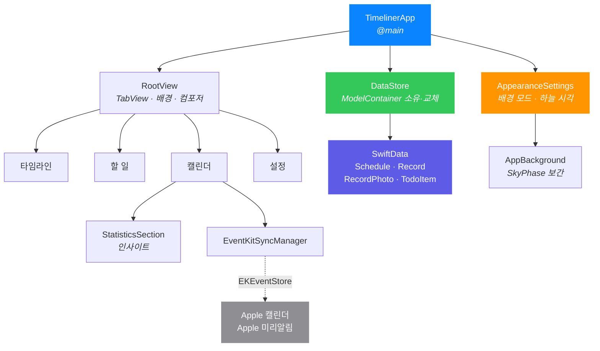

기술 스택은 얇습니다. **외부 의존성이 하나도 없습니다** — 패키지 매니저도, 서드파티 라이브러리도 쓰지 않습니다.

| 층 | 쓰는 것 |
|---|---|
| UI | SwiftUI (iOS 26 Liquid Glass, `TabView` + `tabViewBottomAccessory`) |
| 상태 | `@Observable`, `@StateObject`, `@AppStorage`, `@Query` |
| 저장 | SwiftData (`ModelContainer`, CloudKit 미사용) |
| 차트 | Swift Charts |
| 연동 | EventKit |
| 이미지 | PhotosUI, ImageIO (`CGImageSource` 썸네일) |
| 테스트 | Swift Testing (`@Suite` / `@Test`) |

---

## 데이터 모델

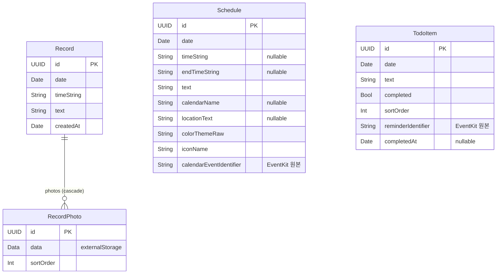

> **사진이 왜 별도 엔티티인가**
> `Record`에 `[Data]`를 두면 SwiftData는 배열 전체를 **하나의 인코딩된 값**으로 저장합니다.
> 그러면 `.externalStorage`를 쓸 수 없고, 기록 한 줄을 읽을 때마다 붙어 있는 사진이 전부 딸려 옵니다.
> 타임라인은 기록을 아주 많이 읽으므로, 사진은 행 바깥에 있어야 합니다.

---

## 눈여겨볼 구현

<details>
<summary><b>1. 레일과 마커는 같은 수식에서 나온다</b> — <code>TimelineRailMetrics</code></summary>

레일 선과 거기 꽂히는 마커들이 **3~7pt씩 어긋나 있던** 버그가 있었습니다.
선은 열 너비에서, 마커는 각자 자기 행의 `HStack` 간격에서 위치를 계산했는데,
그 간격이 행 종류마다 달랐기 때문입니다(일정 6, 기록·할 일 2).

지금은 두 값이 모두 하나의 구조체에서 파생됩니다. 지켜야 할 불변식은 `lineCenterX == markerCenterX`이고,
너비를 어떻게 바꾸든 성립합니다. 대신 행들은 **레일 열 앞에 `HStack` 간격을 넣으면 안 됩니다** —
그 간격은 선이 모르는 채로 마커만 밀어내기 때문입니다.

이 프로젝트의 유일한 단위 테스트 스위트가 이 불변식을 지킵니다 — 테스트 7개, 대부분이 5가지 레이아웃에
파라미터화되어 있습니다.

[`TimelineRailMetrics.swift`](TimelinerApp/Timeliner/Views/Timeline/TimelineRailMetrics.swift) ·
[`TimelineRailMetricsTests.swift`](TimelinerApp/TimelinerTests/TimelineRailMetricsTests.swift)

</details>

<details>
<summary><b>2. 저장소를 갈아끼워도 화면이 무너지지 않게</b> — <code>DataStore</code></summary>

더미/실제 모드를 바꾸면 `ModelContainer`가 통째로 바뀝니다. 순진한 해법은 `.id(dataStore.mode)`로
뷰 트리를 다시 키잉하는 것인데, 그러면 **전환 버튼을 누른 그 화면이 손가락 밑에서 사라집니다.**

대신 `DataStore`는 이번 실행에서 열었던 컨테이너를 **전부 살려 둡니다.** 속도를 위한 캐시가 아닙니다.
컨테이너를 교체해도 화면에는 몇 프레임 동안 이전 저장소의 행들이 남아 있는데,
SwiftData 모델 객체는 컨테이너보다 오래 살아남지 못하고 다음 프로퍼티 접근에서 트랩합니다.
옛 컨테이너를 붙들고 있으면 아무도 그 객체를 보지 않게 될 때까지 화면이 멀쩡히 읽힙니다.

[`DataStore.swift`](TimelinerApp/Timeliner/Utils/DataStore.swift)

</details>

<details>
<summary><b>3. 놓았을 때를 판별하는 법</b> — 당겨서 과거 더 싣기</summary>

맨 위에서 충분히 당긴 뒤 손을 떼면 2주치를 더 싣습니다. 그런데 "충분히 당겼는지"를
손 뗀 순간의 진행도로 판단할 수 없습니다 — 손을 떼는 순간 러버밴딩이 시작되고,
스크롤 페이즈 변경이 도착할 때쯤이면 기하 정보는 이미 0까지 되돌아가 있기 때문입니다.

그래서 임계값을 **넘는 순간에 걸어두고**(`topPullArmed`), 놓기 전에 다시 밀어 올리면 해제합니다.

[`TimelineView.swift`](TimelinerApp/Timeliner/Views/Timeline/TimelineView.swift)

</details>

<details>
<summary><b>4. 사진은 1,200px로 깎아서 그린다</b></summary>

원본 `Data`를 그대로 `UIImage`로 만들면 타임라인이 스크롤되는 동안 메모리가 폭발합니다.
`CGImageSourceCreateThumbnailAtIndex`로 최대 1,200px 썸네일을 만들어 캐시에 담고,
디코딩은 메인 스레드 밖에서(`nonisolated`) 합니다. EXIF 회전도 이때 함께 적용합니다.

배경 이미지는 별개로 `URLCache`를 32MB(메모리) / 256MB(디스크)로 키워 두었습니다 —
골라 둔 배경은 앱을 껐다 켜도, 비행기 안에서도 그대로 있어야 하니까요.

</details>

<details>
<summary><b>5. 하늘은 스냅하지 않고 흐른다</b></summary>

시간대(phase)는 원래 **구간**이었고, 경계에서 하늘이 툭 하고 넘어갔습니다.
지금은 **앵커**입니다: 각 시간대는 "가장 자기다운 시각"(예: 노을 = 20시)을 하나씩 갖고,
실제 하늘은 가장 가까운 두 앵커 사이를 보간한 결과입니다.

팔레트마다 색 정지점 개수가 다르므로(3~5개), 섞기 전에 같은 개수로 리샘플링합니다.

</details>

---

## 시작하기

### 요구 사항

| | |
|---|---|
| Xcode | iOS 26 SDK를 포함한 버전 |
| 배포 타깃 | iOS 26.0 (일부 기능은 26.1) |
| 기기 | iPhone · iPad (시뮬레이터 가능) |
| 의존성 | **없음** — 클론하면 바로 빌드됩니다 |

### 빌드 · 실행

```bash
git clone https://github.com/Nedian0Brien/Timeliner.git
```

```bash
open Timeliner/TimelinerApp/Timeliner.xcodeproj
```

Xcode에서 `Timeliner` 스킴을 고르고 ⌘R.

명령줄에서 시뮬레이터로 빌드하려면:

```bash
xcodebuild -project TimelinerApp/Timeliner.xcodeproj -scheme Timeliner -configuration Debug -destination 'platform=iOS Simulator,name=iPhone 17 Pro' -derivedDataPath build build
```

### 테스트

```bash
xcodebuild test -project TimelinerApp/Timeliner.xcodeproj -scheme Timeliner -destination 'platform=iOS Simulator,name=iPhone 17 Pro'
```

> 테스트 타깃을 찾으려면 공유 스킴(`xcshareddata/xcschemes/Timeliner.xcscheme`)이 있어야 합니다.
> `.gitignore`가 이 경로를 지우지 않도록 되어 있습니다.

### 처음 켰을 때

Debug 빌드는 **더미 데이터** 모드로 시작하고, 디자인용 샘플이 자동으로 채워집니다.
빈 상태에서 보려면 설정 탭에서 **실제 데이터**로 전환하세요 — 그쪽 저장소에는 시드가 한 번도 들어간 적이 없습니다.

---

## 프로젝트 구조

```
TimelinerApp/
├── Timeliner.xcodeproj/
│   └── xcshareddata/xcschemes/Timeliner.xcscheme   # 공유 스킴 (테스트에 필요)
├── Timeliner/
│   ├── TimelinerApp.swift          # @main · URLCache · 저장소 경고 배너
│   ├── ContentView.swift           # RootView · 탭 · 하단 입력 pill
│   ├── Models/
│   │   ├── Record.swift            # 기록 + RecordPhoto
│   │   ├── Schedule.swift          # 일정 (+ 색 테마)
│   │   └── TodoItem.swift          # 할 일 (+ completedAt)
│   ├── Views/
│   │   ├── Timeline/               # 타임라인 — 레일, 카드, 컴포저, 사진 뷰어
│   │   │   ├── TimelineView.swift          # 가장 큰 파일. 스크롤·그룹핑·당기기
│   │   │   ├── TimelineRailMetrics.swift   # 레일 기하의 단일 원천
│   │   │   ├── RecordInputView.swift       # 탭 바 입력 pill
│   │   │   ├── RecordComposerView.swift    # pill에서 자라나는 컴포저
│   │   │   ├── ScheduleRowView.swift · TodoRowView.swift · TimelineGroupView.swift
│   │   │   └── PhotoViewerView.swift
│   │   ├── Todo/TodoListView.swift
│   │   ├── Calendar/CalendarView.swift     # 월 그리드 · 아젠다 · 동기화 카드
│   │   ├── Statistics/StatisticsView.swift # StatisticsSection (캘린더에 삽입)
│   │   ├── Search/SearchView.swift         # ⚠️ 현재 어디에도 연결되어 있지 않음
│   │   ├── Modals/                         # 일정 상세 · 기록 편집
│   │   └── Settings/SettingsView.swift
│   ├── Theme/
│   │   ├── Theme.swift             # SkyPhase · SkyRGB · AppBackground · 유리 카드
│   │   └── ThemeManager.swift      # AppearanceSettings (배경 모드 · 하늘 시각)
│   ├── Services/
│   │   └── EventKitSyncManager.swift
│   ├── Utils/
│   │   ├── DataStore.swift         # 더미/실제 컨테이너 소유·교체
│   │   ├── DateHelpers.swift       # 한국어 날짜 라벨 · 12/24시 변환
│   │   └── SeedData.swift          # #if DEBUG 샘플
│   └── Assets.xcassets/
└── TimelinerTests/
    └── TimelineRailMetricsTests.swift

docs/screenshots/            # README용 스크린샷
scripts/
└── serve-sim-cloudflare-proxy.mjs   # 시뮬레이터 스트림을 한 포트로 모으는 개발 프록시
my_timeline_app.html         # 초기 React 프로토타입 (역사적 기록)
Timeliner-app.html           # 위 프로토타입의 번들 산출물
```

---

## 기여할 때 알아둘 것

이 저장소에는 몇 가지 함정이 있습니다.

> [!IMPORTANT]
> **Xcode 프로젝트는 파일 시스템 동기화 그룹을 쓰지 않습니다.**
> 파일을 추가하거나 지우면 `project.pbxproj`를 직접 고쳐야 합니다. 고치기 전에 백업을 뜨세요.

> [!WARNING]
> **공유 스킴을 지우지 마세요.**
> `TimelinerApp/Timeliner.xcodeproj/xcshareddata/xcschemes/Timeliner.xcscheme`가 있어야
> `xcodebuild test`가 테스트 타깃을 찾습니다.

> [!NOTE]
> **배포 타깃이 iOS 26.0이므로 `if #available` 분기는 대체로 불필요합니다.**
> 지금 코드에 남아 있는 유일한 분기는 iOS 26.1의 `tabViewBottomAccessory`입니다.

> [!NOTE]
> **실제 저장소에는 시드를 넣지 마세요.** `SeedData`는 `#if DEBUG`이고 더미 저장소 전용입니다.

또한 이 저장소는 [`AGENTS.md`](AGENTS.md) / [`CLAUDE.md`](CLAUDE.md)에 코딩 에이전트를 위한
작업 규칙을 두고 있습니다. 화면으로 확인하지 않은 것을 고쳤다고 말하지 않기, 스크린샷만 보고
추측하지 말고 측정하기 같은 것들입니다. 사람이 읽어도 나쁘지 않습니다.

---

## 알려진 한계

| | |
|---|---|
| 🔌 **검색 화면이 연결되어 있지 않습니다** | `SearchView`는 구현되어 있지만 어디에서도 띄우지 않습니다. 타임라인이 내비게이션 바를 숨기면서 `.searchable` 필드가 함께 사라졌고, 새 진입점이 아직 없습니다. |
| ☁️ **동기화가 없습니다** | `cloudKitDatabase: .none`. 데이터는 기기 안에만 있습니다. |
| ↔️ **EventKit은 가져오기만 합니다** | Apple 캘린더/미리알림 → Timeliner 방향만 지원합니다. |
| 🌐 **UI가 한국어 전용입니다** | 문자열이 코드에 직접 박혀 있어 현지화 준비가 되어 있지 않습니다. |
| 📱 **iPad 레이아웃은 확대판입니다** | 유니버설 빌드지만 큰 화면에 맞춘 레이아웃은 아직 없습니다. |
| 📄 **라이선스가 아직 정해지지 않았습니다** | 라이선스 파일이 없으므로 기본적으로 모든 권리는 저작자에게 있습니다. |

---

## 크레딧

- 커스텀 배경의 사진은 Unsplash 사진작가들의 작품이며 [Lorem Picsum](https://picsum.photos)을 통해 제공됩니다.
  Unsplash API는 키를 요구하고 사이트는 스크레이핑을 거부해서 이 경로를 택했습니다.
  앱 안에서 각 사진의 작가 이름과 원본 페이지 링크를 함께 표시합니다.
  NASA, Greg Rakozy, Joshua Hibbert, Alexey Topolyanskiy, Andrew Ridley, Wolfgang Lutz,
  Christian Joudrey, Steve Carter, Ales Krivec, Philippe Wuyts.
- 아이콘은 Apple SF Symbols.

<div align="center">
<br />
<sub>Made with SwiftUI · 기기 안에서만 사는 앱</sub>
</div>
